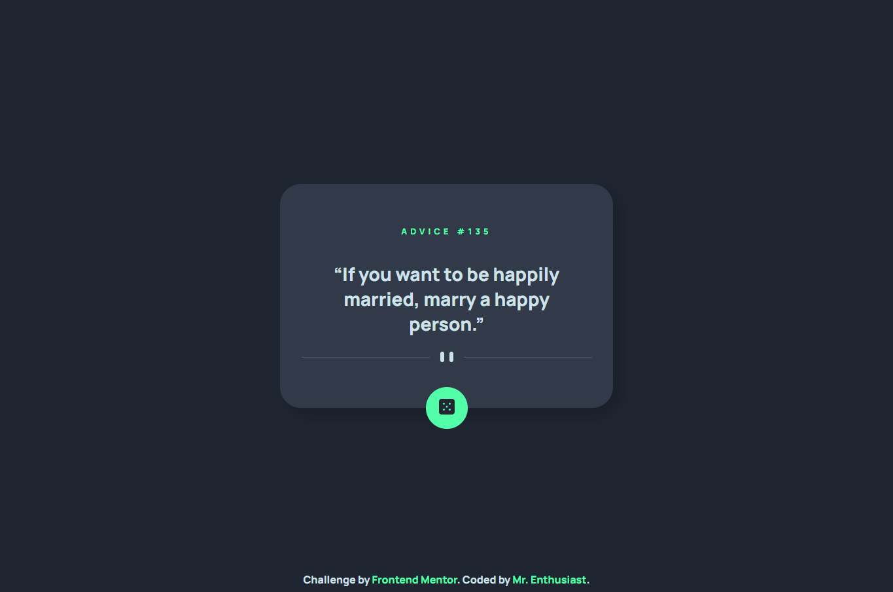

# Frontend Mentor Advice generator app solution

This is a solution to the [Advice generator app challenge on Frontend Mentor](https://www.frontendmentor.io/challenges/advice-generator-app-QdUG-13db). Frontend Mentor challenges help you improve your coding skills by building realistic projects.

## Table of contents

- [Frontend Mentor Advice generator app solution](#frontend-mentor-advice-generator-app-solution)
  - [Table of contents](#table-of-contents)
  - [Overview](#overview)
    - [Links](#links)
  - [My process](#my-process)
    - [Built with](#built-with)
    - [What I learned](#what-i-learned)
    - [Continued development](#continued-development)
    - [Useful resources](#useful-resources)
  - [Author](#author)
  - [Acknowledgments](#acknowledgments)
    - [Feedback (Friends)](#feedback-friends)

## Overview

### Links

- Solution URL: [Link](about:blank)
- Live Site URL: [Link](https://mrenthu-fm-advice-generator.netlify.app)

## My process

### Built with

- Semantic HTML5 markup
- CSS
  - BEM (planned)
  - Flexbox
- Clean JS
  - FetchAPI
  - Error Handling

### What I learned

- Document Object Model
- FetchAPI
- Try Catch
- A bit of animations, responsiveness and shadows

### Continued development

- BEM
- Mobile-first design

### Useful resources

- [Stack Overflow](https://stackoverflow.com): I used this site to search solutions
- Friends: They helped me with first feedbacks

## Author

- GitHub: [Mr. Enthusiast](https://github.com/mrenthu/)
- Frontend Mentor: [@mrenthu](https://www.frontendmentor.io/profile/mrenthu)
- Twitter: [@mr_enthu](https://www.twitter.com/mr_enthu)

## Acknowledgments

This section is dedicated to resources that helped me even a bit with technical issues

### Feedback (Friends)

- Adam "RefixShow": [GitHub](https://github.com/refixshow)
